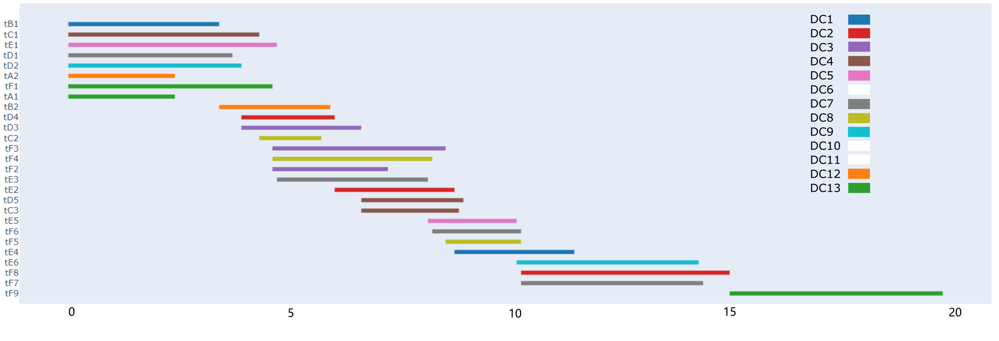
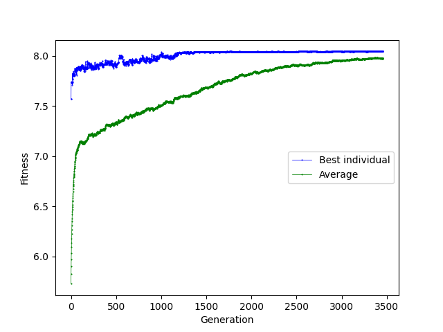
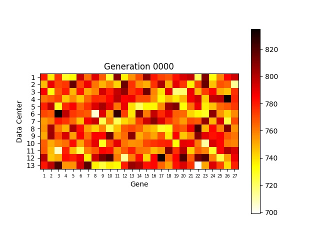
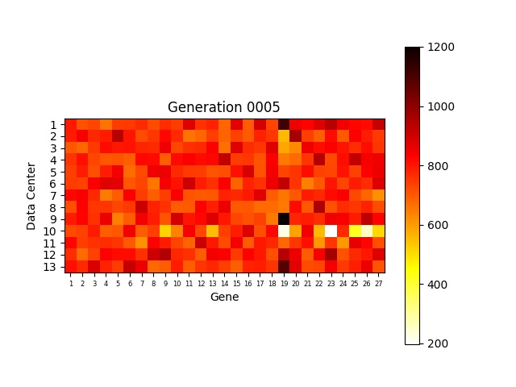
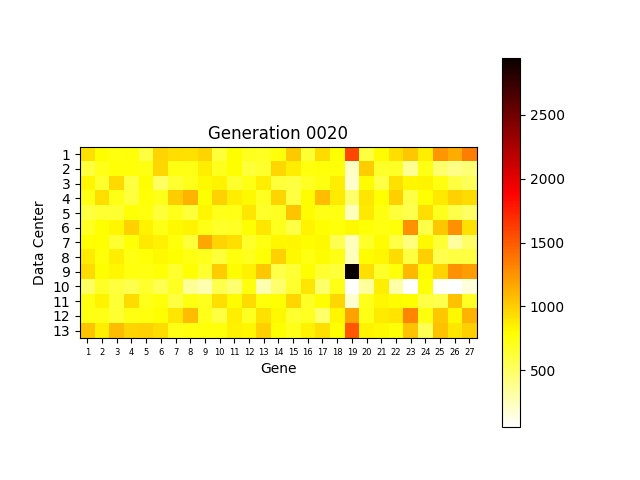
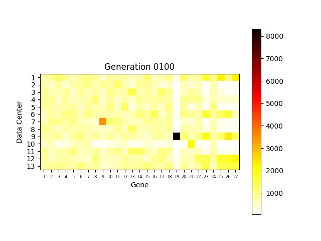
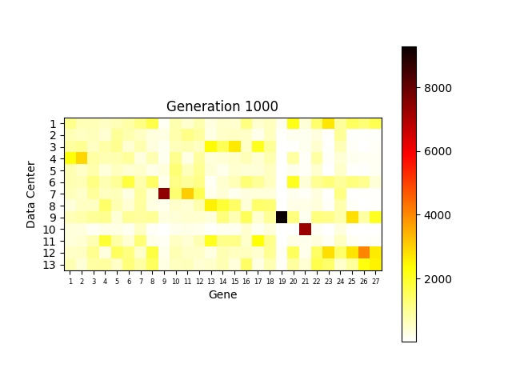
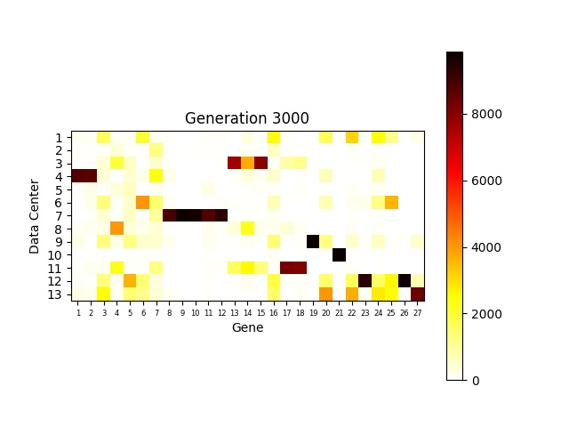

# Introduction

Scheduling computational tasks, as commonly represented by directed
acyclic graphs (DAGs), is an important problem in many areas of computer
science ranging from programming language (e.g., compilation), operating
systems (e.g., parallel processing), data engineering (e.g., distributed
batch/streaming computation topology), to machine learning (e.g.,
training graphs).

Fig. [1](#fig:intro){reference-type="ref" reference="fig:intro"} shows
an example of scheduling multiple jobs across geo-distributed data
centers.

{#fig:intro width="10cm"}

The DAG scheduling problem is a combination of two well-known NP-hard
problems: the Job Shop Scheduling Problem (JSP) [@ref_6] and the Bin
Packing Problem (BPP) [@ref_7; @ref_8]. On the one hand, if we let the
network bandwidth be infinite and the DAG degenerates into a line
segment, the DAG scheduling problem then degenerates into JSP.
Furthermore, if we fix the network transmission cost and computation
cost, then the DAG scheduling problem will degenerate into BPP. Anyway,
there is no effective algorithm to find the optimal solution of this
problem up to now. All the proposed algorithms are either greedy
algorithms, or based on machine learning [@ref_9] or heuristic search.

In this paper, we describe the DAG scheduling problem in mathematical
language. Then we relax the assumption step by step, presenting three
methods to solve the problem.

**Firstly**, we strictly assume that all data centers have unlimited
slots. Every task arriving at the data center can be processed
immediately. In addition, we also assume that the bandwidth does not
contribute to the transmission of tasks between data centers. In other
words, when a fixed size task is transferred from one data center to
another, the time is fixed regardless of other tasks. In this condition,
we propose a task coding method and its **Genetic Algorithm**. Our
method can get a solution (17.65s) which can not be further optimized at
a very fast speed(about 0.8s) for toy-data.

**Secondly**, we remove the hypothesis of unlimited slots. If a ready
task arrives at a data center, it may still be rejected if all the slots
in the current data center are occupied. In this case, we propose a task
simulation system, which uses short task first strategy (SJF) and
stochastic optimization method to get the optimal solution. This method
can also get the optimal solution in a little longer time (about 2s)
than the first method.

**Thirdly**, on the basis of paper [@ref_11], we propose a linear
programming algorithm which is more rigorous than the first two
heuristic algorithms. This method makes full use of convex optimization,
linear programming and other mathematical means, which not only defends
the max-min fairness between tasks, but also optimizes the longest job
complete time.

Next, we write a large-scale data generator to check the robustness of
our algorithms. Finally, we analyze the complexity, advantages and
disadvantages of our algorithms.

# Hardness of DAG Scheduling Problem

We claim that the decision version of DAG Scheduling Problem is a
NP-complete problem. Next is the proof, and our proof idea is:

1.  Show that Job Shop Scheduling Problem is a NP-hard problem.

2.  Prove that the decision version of DAG Scheduling Problem is in NP.

3.  Prove that Job Shop Scheduling Problem $\le_p$ DAG Scheduling
    Problem.

**Firstly**, let's start with Job Shop Scheduling Problem(JSP). The
standard version of the problem is where you have $n$ jobs
$J_1, J_2, \cdots, J_n$. Within each job there is a set of operations
$O_1, O_2, \cdots, O_n$ which need to be processed in a specific order
(known as Precedence constraints). Each operation has a specific machine
that it needs to be processed on and only one operation in a job can be
processed at a given time. A common relaxation is the flexible job shop
where each operation can be processed on any machine of a given set (the
machines in the set are identical).

We claim that JSP problem is a NP-hard problem. Since the Traveling
Salesman Problem(TSP)[@ref_10] is NP-hard, the job-shop problem with
sequence-dependent setup is clearly also NP-hard since the TSP is a
special case of the JSP with a single job, imagine that the cities are
the machines and the salesman is the job.

**Secondly**, we need to discuss the decision version of DAG Scheduling
problem that whether we could verify a solution, whose makespan is no
more than a given number $k$. The earliest thing we need to do is to
check the correctness of the solution. We not only need to check whether
the tasks can be transmitted under the given bandwidth, but also check
whether the prerequisite tasks are completed at the beginning. Of
course, these tests can be completed in linear time, because a single
test only needs to do some subtraction and judgment. That is to say, the
decision version of DAG Scheduling Problem is in NP.

**Thirdly**, we claim that Job Shop Scheduling Problem can be
polynomially reduced to DAG Scheduling Problem. Imagine that all the
bandwidth be infinite and the DAG degenerate to a line, and the data
required by each task is distributed in a fixed DC, and the size is
high-order infinity than bandwidth. Under this assumption, we get the
Job Shop Scheduling Problem: Tasks need to be completed on a fixed
machine, and tasks need to be executed in strict order.

All in all, the decision version of DAG Scheduling Problem is a
NP-complete problem.

# Problem Formalization

## Symbol Table

The symbols used in this paper and their definitions are listed as
following:

::: {#tab:Symbols}
                       **Symbol**                                                                        **Description**
  ----------------------------------------------------- ------------------------------------------------------------------------------------------------------------------
               $\mathcal{K}=\{1,2,...,K\}$                                                         A set of data parallel jobs
               $\mathcal{D}=\{1,2,...,J\}$                                                     A set of geo-distributed datacenters
             $\mathcal{T}_k=\{1,2,...,n_k\}$                                         Each job $k \in \mathcal{K}$ has a set of parallel tasks
                          $a_j$                                            The capacity of available computing slots in datacenter $j \in \mathcal{D}$
                       $c_{i,j}^k$                                   The time to fetch data for task $i \in \mathcal{T}_k$ if it's assigned to datacenter $j$
                        $e_{i}^k$                                                        The execution time of task $i \in \mathcal{T}_k$
                       $x_{i,j}^k$                       The assignment of task $i \in \mathcal{T}_k$, it should be 1 when $i$ is assigned to datacenter $j$, otherwise 0
                         $S_i^k$                                       The set of datacenters where the input data of task $i \in \mathcal{T}_k$ are stored
                       $d_i^{k,s}$                                          The amount of input data for task $i \in \mathcal{T}_k$ from $s \in S_i^k$
                        $b_{s,j}$                                                The bandwidth of the link from datacenter $s$ to datacenter $j$
                        $\tau_k$                                                              The lowest task finish time of job $k$
                  $\langle v \rangle_k$                                             The $k$th largest element of $\mathbf{v} \in \mathbb{Z}^k$
                           $M$                            $M=J\sum_{k=1}^Kn_k$ where $J$ is the total number of datacenters and $n_k$ is the number of tasks in job $k$
   $\lambda_{i,j}^{k,s} \in \mathbb{R}^+, s\in\{0,1\}$                       Newly introduced variables when using $\lambda$-representation technique

  : Symbol Definition
:::

[\[tab:Symbols\]]{#tab:Symbols label="tab:Symbols"}

## Max-Min Fairness

In this section, we give out the formal definition of **Max-Min
Fairness** and transform it into a simpler form to be implemented.

::: definition
[@ref_12] [\[def:maxmin\]]{#def:maxmin label="def:maxmin"} We say that
an allocation vector $\mathbf{x}^0$ is said to be max-min fair in $X$ if
$\mathbf{x}^0 \in X$ and $\mathbf{x}^0$ fulfills the following property:

For any allocation vector $\mathbf{x} \in X$ and for any connection $d$
such that $x_d > x_d^0$ there exists a connection $d'$ such that
$x_{d'} \leq x_{d'}^0 \leq x_d^0$.
:::

To have a more directive intuition of this , we give out following
auxiliary definitions:

::: definition
[@ref_11] Let $\langle \mathbf{v} \rangle_k$ denote the $k$th
($1 \leq k \leq K$) largest element of $\mathbf{v} \in \mathbb{Z}^K$,
implying
$\langle \mathbf{v} \rangle_1 \geq \langle \mathbf{v} \rangle_2 \geq ... \geq \langle \mathbf{v} \rangle_K$.
Intuitively,
$\langle \mathbf{v} \rangle = (\langle \mathbf{v} \rangle_1, \langle \mathbf{v} \rangle_2, ... , \langle \mathbf{v} \rangle_K)$
represents the non-increasingly sorted version of $\mathbf{v}$.
:::

::: definition
[@ref_11] For any $\mathbf{\alpha} \in \mathbb{Z}^K$ and
$\mathbf{\beta} \in \mathbb{Z}^K$, if
$\langle \mathbf{\alpha} \rangle_1 < \langle \mathbf{\beta} \rangle_1$
or $\exists k \in \{2,3,...,K\}$ such that
$\langle \mathbf{\alpha} \rangle_k < \langle \mathbf{\beta} \rangle_k$
and
$\langle \mathbf{\alpha} \rangle_i < \langle \mathbf{\beta} \rangle_i, \forall i \in \{1,...,k-1\}$,
then $\mathbf{\alpha}$ is lexicographically smaller than
$\mathbf{\beta}$, represented as $\mathbf{\alpha} \prec \mathbf{\beta}$.
Similarly, if
$\langle \mathbf{\alpha} \rangle_k = \langle \mathbf{\beta} \rangle_k, \forall k \in \{1,2,...K\}$
or $\mathbf{\alpha} \prec \mathbf{\beta}$, then $\mathbf{\alpha}$ is
lexicographically no greater than $\mathbf{\beta}$, represented as
$\mathbf{\alpha} \preceq \mathbf{\beta}$.
:::

In a word, Definition [\[def:maxmin\]](#def:maxmin){reference-type="ref"
reference="def:maxmin"} just tells that a vector $\mathbf{x}^0$ is said
to be max-min fair if and only if it is the lexicographically smallest
vector in $X$.

## Assumption

-   We assume the nodes in the graph are fully connected, that is, we
    don't need to divide the bandwidth from one datacenter to another.

-   We always assume that the total slots number is bigger than the
    total task number, that is, the linear equations will always have a
    solution.

-   We don't consider prefetch in this model.

-   We assume tasks in different jobs could run in parallel while tasks
    in different states should execute in order.

## Model And Formulation

Considering a set of data parallel jobs $\mathcal{K} = \{1,2,...,K\}$
submitted to the scheduler for task assignment. For convenience, we
first discuss the case that all the tasks could run in parallel, without
the constraint of states.

Each job $k \in \mathcal{K}$ will have a set of parallel tasks
$\mathcal{T}_k = \{1,2,...,n_k\}$, and for each task
$i \in \mathcal{T}_k$, the time it takes to complete consists of both
the network transfer time, denoted by $c_{i,j}^k$, to fetch the input
data if the task is assigned to datacenter $j$, and the execution time
represented by $e_{i,j}^k$.

For $c_{i,j}^k$, it's determined by both the amount of data to be read,
and the bandwidth on the link the data transfers. Let $S_i^k$ denote the
set of datacenters where the input data of task $i$ from job $k$ are
stored, the task needs to read the input data from each of its source
datacenters $s \in S_i^k$, the amount of which is $d_i^{k,s}$. Let
$b_{s,j}$ denote the bandwidth of the link from datacenter $s$ to
datacenter $j$, $c_{i,j}^k$ should be the maximum of all the transfer
time from the task's source datacenters, that is:
$$c_{i,j}^k = \mbox{max}_{s \in S_i^k} d_i^{k,s}/b_{s,j}$$

We use a binary variable $x_{i,j}^k$ to represent the assignment of a
task, indicating whether the $i$th task of job $k$ is assigned to
datacenter $j$. A job $k$ completes when its slowest task finishes, thus
the job completion time of $k$, represented by $\tau_k$, is determined
by the maximum completion time among all of its tasks, expressed as
follows:
$$\tau_k = max_{i \in \mathcal{T}_k, j \in \mathcal{D}} x_{i,j}^k(c_{i,j}^k+e_{i,j}^k)$$

As we've discussed above, our target is to maintain max-min fairness
when scheduling tasks, that is, to achieve the lexicographical
minimization of the vector $\bold{f}=(\tau_1,\tau_2,...,\tau_K)$ while
holding the necessary constraints. Based on the symbols we've defined
before, we could formalize the problem as following: $$\begin{aligned}
    \mbox{lexmin}_x \quad &f=(\tau_1,\tau_2,...,\tau_K) \label{eq:target1}\\
\mbox{s.t.} \quad &\tau_k = \mbox{max}_{i \in \mathcal{T}_k, j \in \mathcal{D}} x_{i,j}^k(c_{i,j}^k+e_{i,j}^k), \forall k \in \mathcal{K} \label{eq:con1}\\
&\sum_{k \in \mathcal{K}} \sum_{i \in \mathcal{T}_k} x_{i,j}^k \leq a_j, \forall j \in D \label{eq:con2}\\
&\sum_{j \in \mathcal{D}} x_{i,j}^k = 1, \forall i \in \mathcal{T}_k, \forall k \in \mathcal{K} \label{eq:con3}\\
&x_{i,j}^k \in \{0,1\}, \forall i \in \mathcal{T}_k, \forall j \in \mathcal{D}, \forall k \in \mathcal{K} \label{eq:con4}\end{aligned}$$

where constraint [\[eq:con1\]](#eq:con1){reference-type="ref"
reference="eq:con1"} represents the completion time of each job $k$,
constraint  [\[eq:con2\]](#eq:con2){reference-type="ref"
reference="eq:con2"} indicates that the total number of tasks to be
assigned to data-center $j$ does not exceed its capacity $a_j$, which is
the total number of available computing slots.
Constraint [\[eq:con3\]](#eq:con3){reference-type="ref"
reference="eq:con3"} implies that each task should be assigned to a
single data-center.

## Target of Models

As is mentioned above, we are willing to design $3$ models to solve the
problem. We should first determine the target of each model based on the
comprehension of **max-min fairness**.

1.  For the GA model, we regard the procedure to satisfy max-min
    fairness as minimizing the completion time of the longest job. The
    reason of this comprehension is that this method make sure that
    there will not be a job occupying single resource for a long time,
    which optimize the max-min fairness to some extent. Furthermore, we
    should optimize the average completion time of the jobs
    simultaneously. Therefore, the target of GA model is minimizing the
    average completion time while minimizing the completion time of the
    longest job.

2.  For the random optimization algorithm and SJF model, we similarly
    optimize the completion time of the last job and the average
    completion time.

3.  For the LP model, we strictly optimize the lexicographical order of
    the job completion time. This is a very strict and powerful
    optimization method, since both the average completion time and the
    max-min fairness are optimized during the minimization of
    lexicographical order.

# Data Preprocessing

After the preliminary analysis of the data-set, we find that there may
be some troubles when using the data:

1.  Tasks of each job may rely on the completion of the former jobs,
    thus the execution order is restricted.

2.  The bandwidth between some of the data-centers is $0$, meaning that
    it is impossible to transfer data between them. If a task in one of
    them require the data from the task in another, the whole processing
    procedure would collapse.

To solve the above problems, we adopt the following methods:

1.  We separate the tasks into different stages by **Topological Sort**.
    This method explicitly shows the restriction between the tasks. The
    effect of **Topological Sort** is shown in Fig.
    [2](#fig:topological sort){reference-type="ref"
    reference="fig:topological sort"}.

    {#fig:topological sort width="15cm"}

2.  We update the bandwidth between each data-center using the transfer
    station method, making sure that every pair of data-center is
    connected. The idea of this method is that if the bandwidth between
    two data-centers $A$ and $B$ is $0$, we may find a middle transfer
    station $C$, and the new bandwidth between $A$ and $B$ is
    $\min \left( bandwidth_{A\rightarrow C},bandwidth_{C\rightarrow B} \right)$.
    An example of the result of this method is shown in Fig.
    [3](#fig:transfer station){reference-type="ref"
    reference="fig:transfer station"}.

    {#fig:transfer station
    width="15cm"}

# Algorithm Design

In this section, we first determine the constraints of the problem based
on the analysis of data-set and requirements.

Then, starting from a loose situation with fewer constraints, we
gradually make the constraints more and more strict and respectively
design $3$ algorithms for situations with different strictness.

## Loose Strictness: Genetic Algorithm (GA)

### Brief Algorithm Introduction

Since the scheduling problem has a very large feasible region, which is
impossible to find the optimal solution in polynomial time, so we
believe that using an algorithm to narrow the search space should be the
first try.

After preliminary analysis, we find that the relatively good scheduling
methods have some features in common. Therefore, our algorithm may be
able to get the optimal solution by learning the features and generating
better solutions by combining the features.

To learn and combine the features, the genetic algorithm (GA) may be an
excellent method. Inspired by the process of natural selection, genetic
algorithm is usually used to optimize a search problem relying on
biologically inspired operators such as crossover, mutation and
selection.

During the evolution, the individuals of better solutions are more
likely to survive due to higher fitness, and the next generation is
generated by combining the gene of the alive individuals, which is
exactly the procedure to learn and combine the features of good
solutions.

### Encoding Method

In order to transform each solution into the gene of an individual in
the genetic algorithm, an encoding method should be figured out.

The encoding method must satisfy the following rules:

1.  Each feasible scheduling method has a one-to-one correspondence with
    its gene.

2.  Genes are allowed to mutate without losing feasibility.

3.  A pair of genes can crossover with each other and generate new genes
    of feasible solutions.

To satisfy the rules above, we encode each solution by the following
procedure:

1.  For each task, encode the task with the ID of data-center it is
    processed

2.  For each job, create an array representing the processing location
    of its tasks

3.  Concatenate the arrays of all jobs into a long array, and this array
    is the gene of the scheduling method

Here is an example to illustrate the encoding procedure:

Suppose there is two jobs: **A** and **B**. **A** consists two tasks:
**tA1** and **tA2**, while **B** consists one task: **tB1**. And our
scheduling method is depicted in Table
[2](#tab:scheduling method){reference-type="ref"
reference="tab:scheduling method"}.

::: {#tab:scheduling method}
  ----- ------ -------------
   Job   Task   Data Center
    A    tA1        DC1
         tA2        DC3
    B    tB1        DC2
  ----- ------ -------------

  : Example of the scheduling method
:::

[\[tab:scheduling method\]]{#tab:scheduling method
label="tab:scheduling method"}

Then, our encoding procedure can be shown as follows: $$\begin{cases}
    A:\left[ 1,3 \right]\\
    B:\left[ 2 \right]\\
\end{cases}\Rightarrow \left[ \left[ 1,3 \right] ,\left[ 2 \right] \right] \xrightarrow{\mathrm{concatenate}}\left[ 1,3,2 \right]$$

### Simulation

After encoding each scheduling method by a gene, we should design a way
to decode each gene and execute the simulation of the real computation
procedure. The simulation includes the following works:

1.  Firstly, we construct an Directed-Acyclic-Graph (DAG).

    In the DAG, each node represents a task, the weight of which is the
    execution time of the task. Moreover, each edge represents the time
    needed to transfer data after the former task is done.

2.  Secondly, we separate the tasks into different stages using the
    topological sort. Then, we add a source node and a sink node on the
    beinning and end of the graph respectively.

3.  Eventually, to compute the finish time of each task, we only need to
    compute a finish time of each node by equation
    [\[finish time\]](#finish time){reference-type="ref"
    reference="finish time"}: $$F_j=F_i+W_j+\max \left( E_{kj} \right)
            \label{finish time}$$ Variables $F_i$, $W_i$ respectively
    means the finish time and the execution time of task $i$, while
    $E_{kj}$ means the weight of edge connecting task $k$ and $j$.

### Optimization Method

After decoding each gene and simulating the computation process, we are
able to optimize the performance of the population.

Before the optimizing method we should first determine the goal. We are
required to minimize the average completion time of all jobs while
maintaining max-min fairness on computation resource.

After the analysis of the requirements, we think that our goal is
minimizing the following two parts:

1.  Average completion time of all jobs, which is clearly required.

2.  The completion time if all jobs, since we believe that minimizing
    the total completion time satisfies the max-min fairness to some
    extent.

Therefore, we design the fitness of the gene as equation
[\[fitness\]](#fitness){reference-type="ref" reference="fitness"} shows,
in which $T_i$ means the completion time of job $i$.
$$fitness=\frac{1}{\mathrm{mean}\left( T_i \right) *\max \left( T_i \right)}
    \label{fitness}$$ Then, by maximizing the fitness with GA, we could
optimize the performance of gene.

### Complexity Analysis

The complexity of the GA algorithm is the complexity of the optimization
procedure.

Before the analysis, we define the meaning of symbols in Table
[3](#tab:GA){reference-type="ref" reference="tab:GA"}

::: {#tab:GA}
   **Symbol**                    **Definition**
  ------------ ---------------------------------------------------
      $G$                     number of generation
      $P$                       population amount
      $L$                        length of gene
      $E$                  number of edges in the DAG
   $T_{func}$   The time used to evaluate an individual's fitness
   $T_{opt}$      The total time of the optimization procedure

  : Symbols used in the analysis of GA
:::

[\[tab:GA\]]{#tab:GA label="tab:GA"}

The optimization is analyzed as following:
$$T_{opt}=G\times \left[ P\times T_{func}+\left( P\times \log \left( P \right) +P^2 \right) +P\times L \right]$$

$P\times T_{func}$ represents the time used to evaluate the whole
population, $P\times \log \left( P \right) +P^2$ is the time sort the
individuals and select the individuals with higher fitness, and
$P\times L$ means the time needed to crossover and generate the new
generation.

Furthermore, we should also analyze the complexity of the fitness
computation. When computing the fitness, we should traverse each edge in
the DAG once and only once, which represents the data dependent.
Therefore, the time complexity of fitness computation is $O(E)$.

All in all, the time complexity of the GA is:
$$T_{opt}=O\left( G\times \left[ P\times E+\left( P\times \log \left( P \right) +P^2 \right) +P\times L \right] \right) =\begin{cases}
    O\left( G\times P^2 \right) , P\,\,\mathrm{is} \mathrm{relatively} \mathrm{large}\\
    O\left( P\times E \right) , E\,\,\mathrm{is} \mathrm{relatively} \mathrm{large}\\
    O\left( P\times L \right) , L\,\,\mathrm{is} \mathrm{relatively} \mathrm{large}\\
\end{cases}$$

## Simulation: SJF and Random Optimization

### Encoding Method

We construct a task chain for each data center, and each task appears
only once. For each task on the chain, only the task in front of the
chain is completed, can the task be performed. In addition, before
performing a task, it is necessary to ensure that the task's pioneer
tasks are completed and that the current data center slot is not full.
The following two tables shows this encoding method. In particular,
these two encoding methods all belongs to the optimal coding for
toy-data(17.65s).

### Algorithm Design

In this part, we use two strategies: random optimization algorithm and
short job first strategy. We introduce our task simulator firstly.

For the **simulator**, we set up a time heap for each data center and
construct an event heap globally. To simulate programmed task chains, we
traverse each data center. Every DC has a pointer pointing to the
current task to be finished. If the current data center slot is not full
and all the pioneer tasks are completed, then the data will be taken and
the task will be executed. In the global event heap, we build the heap
according to the sequence of events. Every time a task starts to
execute, we add the end event to the event heap. If all data centers
have no tasks to run, then go to the top of the event heap to get an
event, set the current time to the event time and reduce the in-degree
of subsequent tasks by one. If the global task heap is empty and all the
DC's pointers have moved to the last place, then we believe that all
tasks have been carried out. Otherwise, we call we meet a simulator
deadlock.

::: algorithm
eventHeap $\leftarrow$ \[\]
:::

For the **random optimization algorithm**, we first generate the task
code randomly. Next, we perform the simulation and do two kinds of
optimization. If the task pointed to cannot be executed, but there is a
task behind on the task chain that can be executed, then swap the two
and execute the task that was changed to the front. For some two DCs, we
can also schedule the tasks at the end of one's task chain to another
for execution.

For the **SJF strategy**, we not only set the event heap, but also set a
global ready heap to put ready tasks into it. For any event, there are
#DC editions in the ready heap to record the required time the task to
be completed in each DC. We sort the events according to the required
time in ready heap. In each iteration, we go to the top of the ready
heap to pick up a task that has the shortest required time, and then
register the end event in the event heap. When ready heap is empty or
all DCs are full, take an event from event heap to update the global
time.

### Complexity Analysis

We claim that the complexity of simulation algorithm is
$\Theta(|J|n\log n)$, because during each round of traversal the DCs
will complete at least one task. The storage operation of heap needs
logarithmic event complexity. In the worst case, every two rounds of
traversal will encounter a case of no event execution. Then the
complexity is also $\Theta(|J|n\log n)$ because the pop operation's
complexity is also in logarithmic.

We claim that the complexity of SJF is $\Theta(|J|^2 n\log (|J|n))$.
Because in this case every task has $\rm |J|$ version in the heap, so we
need to replace $n$ with $n|J|$ in "$\Theta(|{J}|n\log n)$\".

## Strict Situation: Linear Programming (LP)

### Optimizing the Worst Completion Time among Concurrent Jobs

Our target [\[eq:target1\]](#eq:target1){reference-type="ref"
reference="eq:target1"} is a vector optimization with multiple
objectives. To have a more simple and intuitive overview of the problem,
here we consider the single-objective sub-problem of optimizing the
worst job performance as following: $$\begin{aligned}
    \mbox{min}_x \quad &\mbox{max}_{k \in \mathcal{K}}(\tau_k) \\
\mbox{s.t.} \quad &\mbox{Constraints~\ref{eq:con1},~\ref{eq:con2},~\ref{eq:con3} and~\ref{eq:con4}.}
    \end{aligned}$$

Replacing the completion time $\tau_k$ in the objective with
Equation [\[eq:con1\]](#eq:con1){reference-type="ref"
reference="eq:con1"}, we could induce the following problem with totally
linear constraints: $$\begin{aligned}
    \mbox{min}_x \quad &\mbox{max}_{k \in \mathcal{K}}(\mbox{max}_{i \in \mathcal{T}_k, j \in \mathcal{D}} x_{i,j}^k(c_{i,j}^k+e_{i,j}^k)) \\
\mbox{s.t.} \quad &\mbox{Constraints~\ref{eq:con2},~\ref{eq:con3} and~\ref{eq:con4}.} 
    \end{aligned}
    \label{eq:target2}$$

However, this typical ILP problem is still not that easy to be solved
since it has a complex min-max-max objective, and the integer formular
is not that friendly for Solvers like **Gurobipy**.

Fortunately, reference [@ref_11] tells us that our problem has beautiful
mathematical properties of separable convex objective and totally
unimodular linear constraints. Exploiting these two properties, we can
use the $\lambda$-representation [@ref_11] technique to transform
Problem [\[eq:target2\]](#eq:target2){reference-type="ref"
reference="eq:target2"} into a linear programming problem that has the
same optimal solution: $$\begin{aligned}
    \mbox{min}_{x,\lambda} \quad &\sum_{k \in \mathcal{K}} \sum_{i \in \mathcal{T}_k}\sum_{j \in \mathcal{D}}(\lambda_{i,j}^{k,0}+M^{c_{i,j}^k+e_{i,j}^k}\lambda_{i,j}^{k,1}) \\
\mbox{s.t.} \quad &x_{i,j}^k=\lambda_{i,j}^{k,1}, \forall k \in \mathcal{K}, i \in \mathcal{T}_k, j \in \mathcal{D} \\
&\lambda_{i,j}^{k,0}+\lambda_{i,j}^{k,1}=1, \forall k \in \mathcal{K}, i \in \mathcal{T}_k, j \in \mathcal{D} \\
&\lambda_{i,j}^{k,0},\lambda_{i,j}^{k,1},x_{i,j}^k \in \mathbb{R^+}, \forall k \in \mathcal{K}, i \in \mathcal{T}_k, j \in \mathcal{D} \\
&\mbox{Constraints~\ref{eq:con2} and~\ref{eq:con3}.} 
    \end{aligned}
    \label{eq:target3}$$

Here $M = J\sum_{k=1}^K n_k$, where $J$ is the total number of the
datacenters, while $n_k$ is the total number of tasks in job
$k \in \mathcal{K}$. $\lambda_{i,j}^{k,0}$ and $\lambda_{i,j}^{k,1}$ are
newly introduced variables to avoid $x$'s integrity (it's magical that
this problem's solution will always yiled $x_{i,j}^k$ between 0 or 1).

Solving the above problem with Solvers like Gurobipy, we could achieve
the minimum worst job completion time among all jobs.

### Iteratively Optimizing Worst Completion Times To Achieve Max-Min Fairness

With the sub-problem of minimizing the worst completion time efficiently
solved as an LP problem, we could continue to solve the original
lexicographical minimization problem by minimizing the next worst
completion time iteratively.

Our basic strategy is intuitive: After solving the sub-problem, if we
find that the optimal worst completion time is achieved by a certain job
$k^*$, we could fix all of its tasks, remove them from the equations,
update the state variables, then start the next iteration. All tasks of
job $k^*$ could be removed because one job's completion time is
determined by its longest task, as it has already been minimized, there
is no need to consider other of its tasks. Hence, we could concentrate
on the other jobs' tasks:

::: algorithm
Initialize $\mathcal{K'}=\mathcal{K}$;\
;
:::

As a result, we will minimize the $i$th longest job completion time
after the $i$th iteration, the max-min fairness could be achieved when
Algorithm [\[alg:basicLP\]](#alg:basicLP){reference-type="ref"
reference="alg:basicLP"} terminates.

### Scheduling Jobs In a DAG

In real life, however, there would be more constraints within a job, for
example, the precedence. As shown in
Fig. [2](#fig:topological sort){reference-type="ref"
reference="fig:topological sort"}, a job could be represented by a DAG,
where each directed edge indicates a precedence constraint. To make the
scheduling problem more convenient and practical to be solved, we use
**Topological Sort** to divide the tasks into stages, and add constraint
that all tasks among the same stage could run in parallel after all its
former stages have been completed. Now the problem comes that how should
we scheduler between stages to achieve a more reasonable job completion
time while maintaining the max-mix fairness.

Our basic idea is to maintain a **scheduling pool**. It's not wise to
reschedule all the tasks when a certain stage of a job has been
finished. From the algorithm's perspective, it could raise a high time
complexity. Besides, it's also not practical to move a running task to
another computing slot.

So we develop Algorithm [\[alg:DAG\]](#alg:DAG){reference-type="ref"
reference="alg:DAG"} to deal with DAG-Jobs scheduling: We will push the
tasks in the next stage into the scheduling pool when a certain stage
has finished. And as we've discussed above, we'll only schedule the
newly coming tasks. Under consideration of multiple factors, for
example, to reduce time complexity, or to get more available computing
slots during the scheduling, we set two thresholds to trigger a new
scheduling: the job number threshold $ts_{job}$ and the time threshold
$ts_{time}$. When the jobs in the scheduling pool has exceeded
$ts_{job}$ or the time from last scheduling has exceeded $ts_{time}$, a
new round of scheduling will be triggered.

::: algorithm
Current time $t \leftarrow 0$;\
Task Assignment $\bold{x} \leftarrow \varnothing$; Initialize
$\mathcal{K'}=\mathcal{K}$;\
Push all tasks in stage 1 into the scheduling pool;\
:::

### Optimization In Serial Execution

Though the introduced algorithm could already achieve a reasonable and
effective solution under most of situations, it could still suffer when
encountering some extreme situations. One of the situation could be
shown as below:

{#fig:CounterExp
width="80%"}

The key problem is that sometimes a serial running sequence could be
better than running in parallel, for example, when we have a
supercomputer that beats all the other machines in performance.

To deal with this problem without prejudice to LP's transformation
constraints, we simply add some condition check after running
Algorithm [\[alg:basicLP\]](#alg:basicLP){reference-type="ref"
reference="alg:basicLP"}. Additionally, we should maintain every task's
completion time during execution.

After all the tasks have been set, we'll look back onto the longest time
task in each job. It may have a better place to be computed, but haven't
been scheduled into it due to the number of slots is finite. So we
traverse all the data-centers and try to assign the task into it after a
certain task has finished and a slot has been available again. Adding up
the extra waiting time, if the newly serial execution time is still less
than what we've scheduled before, we'll reschedule the task into the
newly found data-center.

::: algorithm
Find the bottleneck task for each job $k \in \mathcal{K}$ to get
$bottle\_task$;\
:::

The scheduler's general structure is shown in
Fig. [5](#fig:Structure){reference-type="ref"
reference="fig:Structure"}. Now the scheduling algorithm is more robust
and could give more reasonable solutions under extreme situations.

{#fig:Structure
width="80%"}

### Complexity Analysis

**First**, for the space complexity. Suppose we have $K$ jobs, each with
$\mathcal{T}_k$ tasks, and $J$ datacenters. Our algorithm helps to find
$x_{i,j}^k$, that is, the task assignment locations. Let
$N_K = \sum_{i=1}^K \mathcal{T}_k$ denote the total number of tasks, we
use extra $O(N_K \times J)$ space to store the variables. Besides, we
also store matrix such as $c_{s,j}$, which is $O(J^2)$, normally smaller
than $O(N_K \times J)$. So after all, the LP Algorithm's space
complexity is $O(N_K \times J)$.

**Second**, for the time complexity. Taking an eye on
Algorithm [\[alg:DAG\]](#alg:DAG){reference-type="ref"
reference="alg:DAG"}, the main body is a while loop which will run until
all the job has been finished. However, inside the loop
Algorithm [\[alg:basicLP\]](#alg:basicLP){reference-type="ref"
reference="alg:basicLP"} and
Algorithm [\[alg:Serial\]](#alg:Serial){reference-type="ref"
reference="alg:Serial"} will be triggered at random. Here we simply
considering the job threshold, suppose each $\mathcal{T}_k$ job has
$O(log(\mathcal{T}_k))$ stages. Let
$S_K = \sum_{i=1}^K log(\mathcal{T}_k)$ denote the number of total
stages, then the while loop will run $O(S_K)$ times.

Inside each loop, the main time cost is risen from
Algorithm [\[alg:basicLP\]](#alg:basicLP){reference-type="ref"
reference="alg:basicLP"}. Reasonably, we ignore all the update
operations in
Algorithm [\[alg:basicLP\]](#alg:basicLP){reference-type="ref"
reference="alg:basicLP"} and concentrate on Line 3: Solving the LP
problem. If we use **Simplex** method to solve the LP problem, then
according to \[\], it has a polynomial average complexity of number of
variables and constraints, which is $O(N_K^L)$, while the worst time
complexity is of exponential time $O(2^{N_k})$.

So after all, the LP Algorithm has a average time complexity of
$O(S_K \times N_K^L)$ (polynomial) while the worst is
$O(S_K \times 2^{N_k})$ (exponential).

# Test on Toy-Data (Small Data)

In this section, we run our algorithms on the given toy data-set to test
their correctness. Besides, in order to have a deeper insight of our
algorithms, we randomly generate data to conduct more
comparing-experiments, we also list their results here.

## Toy Data Analysis

### Results Overview

The given toy data-set has 6 jobs to be scheduled in 13 different
data-centers, each has several states which should be executed in
sequence. After running our three algorithms on it, we get following
results:

::: {#tab:toyResults}
   **Algorithm**   **Worst JCT (s)**   **Average JCT (s)**   **Running Time (s)**
  --------------- ------------------- --------------------- ----------------------
     Baseline            29.28                12.44                   /
        LP               22.62                9.83                   0.33
        GA               17.65                7.20                   1.02
        SJF              17.75                7.31                  0.701

  : Toy-Data Experiment Results
:::

[\[tab:toyResults\]]{#tab:toyResults label="tab:toyResults"}

In a nutshell, all our three algorithms have much better performance
over the baseline (which is generated in the first iteration of GA).
However, different algorithms seem to have different running time and
task assignment strategies.

As we've discussed above, LP tends to satisfy tight constraints (like
lexicographic order) in every iteration. Besides, it still has defects
of less serial execution, so it may not give out an optimal solution.
However, thanks to the solver **Gurobipy**, LP is the fastest algorithm
among the three as well as yielding a reasonable result. The Genetic
Algorithm runs a bit slower, however, it gives out the best assignment,
so it makes sense when we need to find an optimal scheduling. Finally,
the SJF is a median of running time and assignment, which is also a
great choice when we have limited computing resource.

The best case (17.65s) task assignment state is shown in
Fig. [6](#fig:bestAssign){reference-type="ref"
reference="fig:bestAssign"}.

{#fig:bestAssign
width="80%"}

### GA Optimization Procedure

Typically, we unfold GA's optimization procedure in this subsection.

We initialized 10000 individuals as the initial population, and then
optimized it according to the genetic algorithm.

During the optimization procedure, The fitness of the best individual
and the average fitness both increase gradually, as shown in Fig.
[7](#fig:fitness){reference-type="ref" reference="fig:fitness"}.

{#fig:fitness width="80%"}

Moreover, we found that in the optimization process, the value of each
segment of the gene tends to eventually converge to a certain value or a
few values, so we drew a heat map of the value of the gene in the
optimization process. This means that the algorithm does learn the
features of the better solutions and successfully maintain the features.

The heat map of generation $0$, $5$, $20$, $100$, $1000$ and $3000$ is
shown from Fig. [\[fig:g0\]](#fig:g0){reference-type="ref"
reference="fig:g0"} to Fig. [13](#fig:g3000){reference-type="ref"
reference="fig:g3000"}.

The abscissa in the heat map represents the fragment of the gene, while
the ordinate represents the value, and the color depth represents the
number of times this value is taken.

{#fig:g20 width="5cm"}

{#fig:g20 width="5cm"}

{#fig:g20 width="5cm"}

{#fig:g3000 width="5cm"}

{#fig:g3000 width="5cm"}

{#fig:g3000 width="5cm"}

## Small Data Analysis

After that, we randomly generate some small datasets to further analyze
our algorithms' performance. We draw the worst JCT and running time
charts (refer to Table [7](#tab:smallJCT){reference-type="ref"
reference="tab:smallJCT"} and
Table [\[tab:smallRunTime\]](#tab:smallRunTime){reference-type="ref"
reference="tab:smallRunTime"}) as below:

{#fig:smallRunning
width="8cm"}

{#fig:smallRunning width="8cm"}

From Fig. [\[fig:smallJCT\]](#fig:smallJCT){reference-type="ref"
reference="fig:smallJCT"}, we could find that all our algorithms always
give out results better than the baseline. LP will give a relatively
worse job complete time but satisfying strict max-min fairness.
Generally, the two random algorithms: GA and SJF Algorithm, will give
out close and better results.

From Fig. [15](#fig:smallRunning){reference-type="ref"
reference="fig:smallRunning"}, we could find the same result as what
we've discovered on toy data: LP runs fastest, SJF next, and GA
relatively slower.

## Sensitivity Analysis

It's an interesting and meaningful job to test our algorithms'
sensitivity. Here, we choose the LP algorithm which has two main
variables (job threshold and time threshold) to conduct our experiments.
The results (refer to
Table [\[tab:jobSens\]](#tab:jobSens){reference-type="ref"
reference="tab:jobSens"} and
Table [10](#tab:timeSens){reference-type="ref"
reference="tab:timeSens"}) are shown in the following line charts:

{#fig:timeThreshold
width="8cm"}

{#fig:timeThreshold
width="8cm"}

Before discussion, it's necessary for us to have an overview of results'
changing regularity. The answer may seem weird, but there doesn't exist
tight bound between results and variables. As job threshold growing
bigger, the scheduling algorithm will be triggered less. However, since
we will have more empty slots during each iteration, the total running
time could still be higher. Similarly, though a higher job threshold may
put some tasks waiting for more time, they may have a better place to be
assigned after waiting, so the worst job complete time may still be
reduced. It's exactly the same for time threshold.

So now let's look back on
Fig. [\[fig:jobThreshold\]](#fig:jobThreshold){reference-type="ref"
reference="fig:jobThreshold"} and
Fig. [17](#fig:timeThreshold){reference-type="ref"
reference="fig:timeThreshold"}, we could first find that the worst job
complete time and program running time have almost the same trend under
the changing variables. For job threshold, they may increase then
descend. And for time threshold, almost in a stable state, consistent
with our expectation.

Job threshold seems to have a bigger influence on the algorithm than the
time threshold. For it may have a 30% fluctuation while the time
threshold only 16%. And after all, the LP algorithm could give out
relatively stable results as we could see from the charts.

# Test Efficiency on Larger Data

Finally, we test our algorithms on larger data-sets (Randomly generated,
which have 50, 150, 200, 250 jobs to be scheduled). Based on the
results, we draw the worst job complete time chart (refer to
Table [8](#tab:largeJCT){reference-type="ref" reference="tab:largeJCT"})
as following:

{#fig:largeJCT width="80%"}

From Fig. [18](#fig:largeJCT){reference-type="ref"
reference="fig:largeJCT"} we could see that our algorithms could run
successfully on big data-sets, always achieving better solutions than
the baseline. And a step further, we could find out that the Genetic
Algorithm tends to give better task assignment than SJF Algorithm on
large data-sets.

::: {#tab:GACmp}
   **Scale**   JCT1 (s)   Running Time1 (s)   JCT2 (s)   Running Time2 (s)
  ----------- ---------- ------------------- ---------- -------------------
      50        28.24           1.45           27.26           21.75
      100       33.15           3.19           32.82           22.33
      150       35.68           4.93           35.12           24.65
      200       36.78           6.48           36.61           25.92
      250       40.64           7.85           40.28           27.48

  : Comparison Of GA Algorithm
:::

[\[tab:GACmp\]]{#tab:GACmp label="tab:GACmp"}

Different from the results on small data-sets, the two random algorithm
need to run approximately 20 seconds to get a seemly-optimal solution.
However, at most time their outputs at the beginning are already great
enough to be a reasonable solution as shown in
Table [5](#tab:GACmp){reference-type="ref" reference="tab:GACmp"}.
Further considering the limited computation capability of our laptops,
the two algorithms could be more useful when we have enough computation
resources.

# Conclusion

To summarize all that we've discussed above, we draw the following
conclusions:

-   We define symbols and transform the **max-min fairness** into
    lexicographical order. Furthermore, we formalize the problem with
    notations and set clear targets for our algorithms.

-   We conduct detailed proof to claim that the multi-job scheduling
    problem is in NP-Complete.

-   We design three effective algorithms: Genetic Algorithm (average in
    polynomial time), Shortest Job First (SJF) Algorithm (average in
    polynomial time) and Linear Programming (average in polynomial time)
    to solve the problem.

-   We conduct experiments on the toy data using the three algorithms
    above, find the shortest worst job complete time to be 17.65s while
    the average computation time is 7.54s.

-   We test our algorithms' efficiency on randomly-generated small and
    big data-sets and find out that: all three algorithms give out
    better scheduling than the baseline, LP runs relatively faster while
    GA and SJF could often yield assignments with shorter complete time.

-   We also do sensitivity analysis and many other meaningful
    visualization to further prove our algorithms' efficiency.

# Acknowledgements {#acknowledgements .unnumbered}

First of all, we would like to praise the tacit cooperation of our team.
Although every member in our team is only responsible for his algorithm,
we all work together to accomplish all tasks during the final
integration of the draft.

Secondly, we would like to thank the teaching assistants for this
course. We encountered several problems when completing with the
project, the two teaching assistants answered our questions one by one
with patience.

Thanks to Prof. Gao and Mr. Li for bringing us project problems
together. In the process of completing this task, our group is like
playing a mathematical modeling contest to catch a glimpse of the charm
of the algorithm from the novel dimension of problem solving. In the
process of solving this problem, we fully feel the importance of team
cooperation, and the great improvement of excellent algorithm in time
cost.

Finally, we cannot emphasize more on thanking Mrs. Xiaofeng Gao and Mr.
Lei Wang, who have made great efforts in the course of algorithm. It is
Mrs. Gao who taught us linear programming algorithm, CPLEX solver and
data visualization method. In the process of writing this paper, the use
of solvers, data visualization methods, greedy algorithm and other
contents taught by the teachers are all in use. It can be said that the
course of algorithm has large capacity and many contents, which not only
enriches our empty spare time, but also irrigates our brain with
rigorous computer thinking.

::: thebibliography
8

Vijay V Vazirani. Approximation algorithms. Springer Science & Business
Media, 2013.

Eva Hopper and Brian CH Turton. A review of the application of
meta-heuristic algorithms to 2d strip packing problems. Artificial
Intelligence Review, 16(4):257--300, 2001.

Silvano Martello, David Pisinger, and Daniele Vigo. The
three-dimensional bin packing problem. Operations research,
48(2):256--267, 2000.

Zhigang Hua, Qi Feng, Gan Liu, Shuang Yang. Learning to Schedule DAG
Tasks. arXiv:2103.03412, Mar 2021.

Travelling Salesman Problem(TSP) - Wikipedia,
<https://en.wikipedia.org/wiki/Travelling_salesman_problem>.

Li Chen, Shuhao Liu, Baochun Li, and Bo Li, Scheduling Jobs across
Geo-Distributed Datacenters with MaxMin Fairness, IEEE Transactions on
Network Science and Engineering (TNSE), 6(3):488-500, 2019.

Dritan Nace and Michal Pioro, Max-Min Fairness and its Applications to
Routing and Load-Balancing in Communication Networks: A Tutorial, IEEE
Communications Surveys and Tutorials, 10(1-4): 5-17, 2008.

Simplex Algorithm - Wikipedia,
<https://en.wikipedia.org/wiki/Simplex_algorithm>.
:::

# Appendix {#appendix .unnumbered}

We list experiments data that hasn't been shown in the text in this
section.

::: {#tab:smallJCT}
   Job Number   LP (s)   GA (s)   SJF (s)
  ------------ -------- -------- ---------
       5        0.278    1.066     0.573
       6        0.326    1.019     0.701
       7        0.419    1.341     0.804
       8        0.535    1.840     1.250
       9        0.565    1.826     1.187
       10       0.627    1.795     1.201

  : Small Data Worst JCT Comparison
:::

[\[tab:smallRunTime\]]{#tab:smallRunTime label="tab:smallRunTime"}

::: {#tab:smallJCT}
   Job Number   LP (s)   GA (s)   SJF (s)   Baseline (s)
  ------------ -------- -------- --------- --------------
       5        21.803   16.893   16.755       23.400
       6        22.625   17.655   18.227       29.280
       7        33.824   20.529   20.278       36.740
       8        35.494   24.291   27.001       39.830
       9        36.586   28.102   28.207       40.732
       10       33.787   29.663   29.393       37.800

  : Small Data Worst JCT Comparison
:::

[\[tab:smallJCT\]]{#tab:smallJCT label="tab:smallJCT"}

::: {#tab:largeJCT}
   Job Number   GA (s)   SJF (s)   Baseline (s)
  ------------ -------- --------- --------------
       50       27.273   28.810       40.920
      100       32.170   33.740       44.780
      150       34.573   38.967       50.790
      200       35.576   36.940       50.410
      250       40.690   45.806       55.190

  : Large Data Worst JCT Comparison
:::

[\[tab:largeJCT\]]{#tab:largeJCT label="tab:largeJCT"}

::: {#tab:timeSens}
   Job Threshold   JCT (s)   Running time (s)
  --------------- --------- ------------------
         1         36.586         0.585
         2         36.988         0.556
         3         42.690         0.652
         4         48.820         0.687
         5         44.310         0.562
         6         43.180         0.696

  : Time Threshold Analysis
:::

[\[tab:jobSens\]]{#tab:jobSens label="tab:jobSens"}

::: {#tab:timeSens}
   Time Threshold   JCT (s)   Running time (s)
  ---------------- --------- ------------------
        0.5         38.080         0.658
        1.0         39.010         0.682
        1.5         38.360         0.602
        2.0         41.030         0.617
        2.5         42.060         0.630
        3.0         43.560         0.614

  : Time Threshold Analysis
:::

[\[tab:timeSens\]]{#tab:timeSens label="tab:timeSens"}
